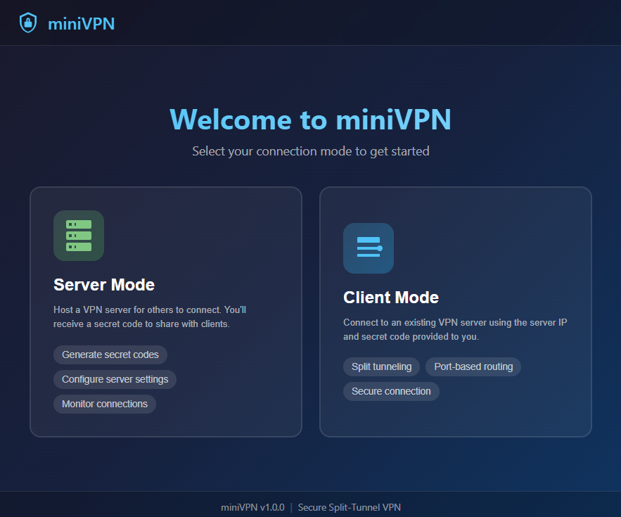

# miniVPN

A lightweight, modern VPN application with split tunneling and NAT traversal support for Windows.

[](https://github.com/alex-luncan/miniVPN/releases/latest/download/miniVPN.exe)
[](https://github.com/alex-luncan/miniVPN/blob/main/license)



## Features

- **Server Mode**: Host a VPN server with auto-generated secret codes
- **Client Mode**: Connect to VPN servers with IP and secret code
- **NAT Traversal**: UDP hole punching for connecting through firewalls and routers
- **Split Tunneling**: Route specific ports through VPN while keeping other traffic on normal network
- **Auto Firewall Rules**: Automatically configures Windows Firewall on startup
- **Modern UI**: Clean, dark-themed interface built with Svelte
- **Single Executable**: Standalone Windows application, no installation required

## Requirements

- Windows 10, Windows 11, or Windows Server 2019+
- Administrator privileges (required for VPN and firewall functionality)

## Quick Start

### Scenario 1: Server has Public IP (Cloud VM, VPS)

This is the simplest setup when your server has a public IP address.

**On the Server (e.g., Azure VM, AWS EC2):**
1. Launch miniVPN and select **Server Mode**
2. Note the generated **Secret Code**
3. Set the **Port** (default: 51820)
4. Click **Start Server**
5. Ensure port 51820 (TCP) is open in your cloud firewall/NSG

**On the Client:**
1. Launch miniVPN and select **Client Mode**
2. Enter the server's **Public IP** and **Port**
3. Enter the **Secret Code**
4. Click **Connect to VPN**

### Scenario 2: Both Peers Behind NAT (Home Networks)

When both server and client are behind routers/NAT, use hole punching.

**Prerequisites:** You need a machine with a public IP to run the signaling server (e.g., a cloud VM).

**Step 1: Start Signaling Server (on machine with public IP)**
```bash
.\signaling-server.exe -port 51821
```
Or use miniVPN and click "Start Signaling" in Server Mode.

**Step 2: On the VPN Server (behind NAT)**
1. Launch miniVPN → **Server Mode**
2. Click **Start Server**
3. In "Register with External Signaling Server", enter: `<signaling-ip>:51821`
4. Click **Register**
5. Note the **Secret Code**

**Step 3: On the Client (behind NAT)**
1. Launch miniVPN → **Client Mode**
2. Enable **NAT Traversal (UDP Hole Punching)**
3. Enter Signaling Server: `<signaling-ip>:51821`
4. Enter the **Secret Code**
5. Click **Connect to VPN**

## Connection Modes

| Server Location | Client Location | Mode to Use |
|----------------|-----------------|-------------|
| Public IP (Cloud) | Anywhere | Direct Connection |
| Behind NAT | Behind NAT | NAT Traversal (Hole Punching) |
| Behind NAT | Public IP | NAT Traversal or Direct (client as server) |

### When to Use NAT Traversal

- **Use Direct Connection** when the server has a public IP (Azure, AWS, VPS, etc.)
- **Use NAT Traversal** when both peers are behind home routers/firewalls

NAT Traversal requires a signaling server running on a machine with a public IP to coordinate the connection.

## Split Tunneling

miniVPN allows you to route only specific ports through the VPN:

- **Include Mode**: Only selected ports go through VPN (e.g., database port 3306)
- **Exclude Mode**: All traffic except selected ports goes through VPN

### Use Cases
- Route only database connections (port 5432, 3306, etc.) through VPN
- Keep general browsing on your normal connection
- Reduce VPN bandwidth usage
- Test specific services while maintaining normal connectivity

## Firewall Configuration

miniVPN automatically creates Windows Firewall rules on startup. The rules are:
- `miniVPN UDP` - Allows UDP traffic for hole punching
- `miniVPN TCP` - Allows TCP traffic for VPN connections

For cloud servers, you also need to open ports in your cloud provider's firewall:
- **Port 51820 (TCP)** - VPN server
- **Port 51821 (UDP)** - Signaling server (if running)

### Azure NSG Example
```
Inbound Rule: Allow TCP 51820 from Any
Inbound Rule: Allow UDP 51821 from Any
```

## Building from Source

### Prerequisites
- Go 1.21+
- Node.js 18+
- Wails CLI (`go install github.com/wailsapp/wails/v2/cmd/wails@latest`)

### Build Steps
```bash
cd build
wails build
```

The executable will be created in `build/build/bin/miniVPN.exe`.

### Build Signaling Server (optional)
```bash
cd build
go build -o signaling-server.exe ./cmd/signaling-server/
```

## Project Structure

```
miniVPN/
├── build/                      # Source code
│   ├── main.go                 # Go entry point
│   ├── app.go                  # Application logic
│   ├── cmd/
│   │   └── signaling-server/   # Standalone signaling server
│   ├── internal/
│   │   ├── vpn/                # VPN protocol implementation
│   │   ├── holepunch/          # NAT traversal / hole punching
│   │   ├── firewall/           # Windows Firewall management
│   │   ├── splittunnel/        # Split tunneling logic
│   │   └── tun/                # Virtual network adapter
│   ├── frontend/               # Svelte UI
│   └── wails.json              # Wails configuration
├── docs/                       # Documentation
│   └── images/                 # Screenshots
└── README.md
```

## Troubleshooting

### "Connection failed" with direct connection
1. Check that the server is running and shows "Running" status
2. Verify the server's firewall allows inbound TCP on the VPN port
3. Confirm you're using the correct IP address and port

### "Peer not found" with hole punching
1. Ensure the signaling server is running and accessible
2. Verify the VPN server has registered with the signaling server
3. Check that the secret code matches exactly

### "Hole punch timeout - NAT may be symmetric"
Some NAT types (symmetric NAT) are difficult to punch through. Try:
1. Using a server with a public IP instead
2. Running the signaling server on a different port
3. Using a relay/TURN server (not yet implemented)

### Firewall issues
Run miniVPN as Administrator to allow automatic firewall rule creation.

## Security

- Connections are authenticated using a 20-character secret code
- Traffic is encrypted using AES-256-GCM
- Key exchange uses Curve25519 ECDH
- Secret codes are regenerated on each server start

## License

MIT License

## Author

alex-luncan
